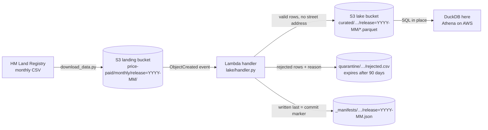

# Serverless property data lake (S3 + Lambda pattern)

> **Status: in progress.** The ingest layer (landing bucket → Lambda-style handler → validated Parquet lake) is built, tested and run on the real September 2026 release. Next: SQL analytics over the lake, then deployment notes (infrastructure template and running costs).

**Business question:** an estate agency or property-data team wants fresh sold-price data every month for pricing advice and market reports. How can it land HM Land Registry's monthly file, check it, and make it queryable with SQL, **without running a server or a database**, and without storing more personal address data than it needs?

This repo builds the standard AWS answer: files land in an S3 bucket, an S3 event triggers a Lambda function, the function validates the file and writes Parquet to a data lake, and analysts query the Parquet in place (Athena-style). Everything runs **offline** against [moto](https://github.com/getmoto/moto), an S3 emulator, so no AWS account or credentials are needed. The handler is ordinary boto3 code, so the same code would run on AWS.

## Architecture



| Piece | File | What it does |
|---|---|---|
| Bucket setup | `lake/infra.py` | Creates the landing and lake buckets with public access blocked, encryption at rest (SSE-S3), versioning on, and a lifecycle rule that deletes quarantine files after 90 days. Safe to run twice. |
| Validation | `lake/schema.py` | Parses the header-less CSV, rejects rows that break hard rules (GUID id, no duplicate ids, whole-pound price > 0, valid date not after the release month, published codes only), and flags odd-but-legal rows. |
| Handler | `lake/handler.py` | `lambda_handler(event, context)`: decodes the S3 event, writes curated Parquet, the quarantine CSV and the manifest. |
| Local run | `scripts/run_local.py` | Starts the emulator, uploads the file, fires the same event S3 would send (twice), queries the lake with DuckDB and writes [`results/ingest_summary.md`](results/ingest_summary.md). |

### Design choices
- **Idempotent by design.** S3 delivers events *at least once*, so a duplicate is normal, not an error. The manifest stores the source file's ETag. The same ETag means skip; a corrected re-upload (new ETag) is reprocessed and overwrites the same keys, so there are never duplicate rows.
- **Manifest written last.** A reader only trusts a release once its manifest exists, so a crash during a first load never publishes a half-loaded month. Each output is a single S3 object, and an S3 PUT is all-or-nothing, so no reader ever sees a half-written file.
- **Data minimisation.** House number, flat, street and locality are dropped, and the postcode is cut to its district (`NW7`) and sector (`NW7 1`). That's enough for market analysis, and the lake holds no street-level addresses.
- **Quarantine, not silent drops.** Bad rows are kept with a reason so the data team can raise them with the publisher. They're deleted automatically after 90 days.
- **Release partitions.** `release=YYYY-MM` folders let SQL engines skip months they don't need (partition pruning), which is what keeps Athena-style queries cheap.

## Data
[HM Land Registry Price Paid Data](https://www.gov.uk/government/statistical-data-sets/price-paid-data-downloads), monthly update file: the property sales in England and Wales that HM Land Registry registered since its previous release, as a *change feed*. Each row is marked **A** (added), **C** (changed) or **D** (deleted). `scripts/download_data.py` fetches it (~16 MB) and pins the release in `data/raw/source.json` (Last-Modified date, size, SHA-256), because the file is replaced every month.

The results here use the release published on **2026-09-28** (SHA-256 `5236cb389b294f33…`), labelled `2026-09` by publication month.

Licence: Contains HM Land Registry data © Crown copyright and database right 2026. This data is licensed under the [Open Government Licence v3.0](https://www.nationalarchives.gov.uk/doc/open-government-licence/version/3/). Raw files aren't committed.

## First results: ingesting the September 2026 release
From [`results/ingest_summary.md`](results/ingest_summary.md):

- **90,867 rows in, 90,867 valid, 0 rejected.** HM Land Registry's file passes every hard rule. The quarantine path is still tested with deliberately broken rows (`tests/test_lake.py`).
- **The second, identical event was skipped** ("same source ETag already processed"), so a duplicate delivery doesn't double-count.
- **It's mostly new sales, plus corrections:** 86,284 added, 3,095 changed and 1,488 deleted records. A report that only appends rows and ignores C/D would be wrong, which the analytics step has to handle.
- **Kept but flagged:** 255 rows with no postcode, 293 sales under £10k, 296 at £5M or more, and 1,774 transfers dated before 2020 (late registrations or corrections). Transfer dates in this release run from 1995-01-12 to 2026-08-28.
- **The curated Parquet is 10.7% of the CSV size** (1.69 MB vs 15.8 MB) and carries no street-level address. Smaller files mean cheaper storage and cheaper scans.

**So what for the business:** for a small team, a monthly market-data feed can run with no server to patch and no database to size. The pipeline is safe to re-run, keeps bad data visible instead of silently dropping it, and stores only the location detail that market analysis needs.

## How to run
```bash
uv venv && source .venv/bin/activate        # or python -m venv .venv
uv pip install -r requirements.txt           # or pip install -r requirements.txt
python scripts/download_data.py              # ~16 MB → data/raw/ (+ source.json)
python scripts/run_local.py                  # emulator → ingest → results/ingest_summary.md
pytest                                       # 7 offline tests (moto in-process)
```
No AWS account is needed: `run_local.py` uses dummy credentials against a local emulator on `127.0.0.1:5055`. DuckDB downloads its `httpfs` extension once, on first run.

## Roadmap
- [x] Download script with release pinning
- [x] Bucket setup with security defaults
- [x] Lambda-style handler: validation, curated Parquet, quarantine, manifest, idempotency
- [x] Local end-to-end run + 7 offline tests
- [ ] SQL analytics over the lake (applying the A/C/D change feed, prices and volumes by region and property type, new-build premium, registration lag)
- [ ] Deployment notes: an infrastructure-as-code template (S3 event → Lambda), IAM least-privilege policy, and a monthly cost estimate
- [ ] Findings, recommendations and limitations
