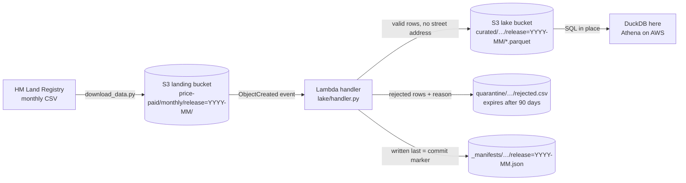

# Serverless property data lake (S3 + Lambda pattern)

> **Status: complete.** Built, tested (21 offline tests) and run end to end on HM Land Registry's September 2026 release against a local S3 emulator. It hasn't been deployed to a real AWS account; the [SAM template](infra/template.yaml) and [deploy guide](docs/DEPLOY.md) are ready for that.

**Business question:** an estate agency or property-data team wants fresh sold-price data every month for pricing advice and market reports. How can it land HM Land Registry's monthly file, check it, and make it queryable with SQL, **without running a server or a database**, and without storing more personal address data than it needs?

## TL;DR
- **The pipeline works and is cheap.** A monthly file (90,867 rows) lands in S3, a Lambda-style handler validates it and writes Parquet, and SQL runs on the Parquet in place. It costs **about $0.05 a month** at London list prices, and Athena queries make up 91% of that.
- **It's safe to re-run, and the access rules are tested.** A duplicate S3 event is skipped and a re-upload overwrites, so rows are never doubled. Bad rows go to quarantine instead of being dropped. The function's IAM policy was tested with enforcement on: it can't delete anything or write outside the lake.
- **It stores less personal data than the source.** Street addresses are dropped and postcodes are cut to the sector, and the Parquet is 10.7% of the CSV's size.
- **The latest months are incomplete when they're published.** 39.0% of existing-home sales and 96.2% of new-build sales in this release completed 4+ / 7+ months earlier. A "latest month" chart would show a slowdown that isn't real.
- **Pricing insight:** category B entries (repossessions, buy-to-let, company sales) are 17.7–18.5% of terraced and flat entries vs 5.2% of detached. A new-build semi sells for **+11.7%** over existing semis in the same district (51 districts); a new-build detached home sells for only **+1.9%** more.
- **Main gap:** the lake starts with this release, so none of the 3,095 corrections or 1,488 deletions can be applied yet. Trend reporting needs a one-off historical backfill, which is designed but not built.

This repo builds the standard AWS answer: files land in an S3 bucket, an S3 event triggers a Lambda function, the function validates the file and writes Parquet to a data lake, and analysts query the Parquet in place (Athena-style). Everything runs **offline** against [moto](https://github.com/getmoto/moto), an S3 emulator, so no AWS account or credentials are needed. The handler is ordinary boto3 code, so the same code would run on AWS.

## Architecture



| Piece | File | What it does |
|---|---|---|
| Bucket setup | `lake/infra.py` | Creates the landing and lake buckets with public access blocked, encryption at rest (SSE-S3), versioning on, and a lifecycle rule that deletes quarantine files after 90 days. Safe to run twice. |
| Validation | `lake/schema.py` | Parses the header-less CSV, rejects rows that break hard rules (GUID id, no duplicate ids, whole-pound price > 0, valid date not after the release month, published codes only), and flags odd-but-legal rows. |
| Handler | `lake/handler.py` | `lambda_handler(event, context)`: decodes the S3 event, writes curated Parquet, the quarantine CSV and the manifest. |
| Local run | `scripts/run_local.py` | Starts the emulator, uploads the file, fires the same event S3 would send (twice), queries the lake with DuckDB and writes [`results/ingest_summary.md`](results/ingest_summary.md). |
| Query layer | `lake/query.py`, `sql/` | Points DuckDB at the Parquet in S3 (Athena-style), exposes every release as one `changes` view, and runs the six numbered SQL files. |
| Analytics | `scripts/analyse_lake.py` | Rebuilds the lake on the emulator, runs `sql/` and writes [`results/ANALYTICS.md`](results/ANALYTICS.md), one CSV per query and three charts. |
| Deployment | `infra/template.yaml`, `infra/package.py` | AWS SAM template for the same buckets, the S3 → Lambda trigger, a least-privilege function role and an upload-only policy, plus the script that bundles the function code. See [`docs/DEPLOY.md`](docs/DEPLOY.md). |
| Running cost | `scripts/estimate_costs.py` | Prices from the public AWS Price List, workload measured on the emulator → [`results/COSTS.md`](results/COSTS.md). |

### Design choices
- **Idempotent by design.** S3 delivers events *at least once*, so a duplicate is normal, not an error. The manifest stores the source file's ETag. The same ETag means skip; a corrected re-upload (new ETag) is reprocessed and overwrites the same keys, so there are never duplicate rows.
- **Manifest written last.** A reader only trusts a release once its manifest exists, so a crash during a first load never publishes a half-loaded month. Each output is a single S3 object, and an S3 PUT is all-or-nothing, so no reader ever sees a half-written file.
- **Data minimisation.** House number, flat, street and locality are dropped, and the postcode is cut to its district (`NW7`) and sector (`NW7 1`). That's enough for market analysis, and the lake holds no street-level addresses.
- **Quarantine, not silent drops.** Bad rows are kept with a reason so the data team can raise them with the publisher. They're deleted automatically after 90 days.
- **Release partitions.** `release=YYYY-MM` folders let SQL engines skip months they don't need (partition pruning), which is what keeps Athena-style queries cheap.

## Data
[HM Land Registry Price Paid Data](https://www.gov.uk/government/statistical-data-sets/price-paid-data-downloads), monthly update file: the property sales in England and Wales that HM Land Registry registered since its previous release, as a *change feed*. Each row is marked **A** (added), **C** (changed) or **D** (deleted). `scripts/download_data.py` fetches it (~16 MB) and pins the release in `data/raw/source.json` (Last-Modified date, size, SHA-256), because the file is replaced every month.

The results here use the release published on **2026-09-28** (SHA-256 `5236cb389b294f33…`), labelled `2026-09` by publication month.

Licence: Contains HM Land Registry data © Crown copyright and database right 2026. This data is licensed under the [Open Government Licence v3.0](https://www.nationalarchives.gov.uk/doc/open-government-licence/version/3/). Raw files aren't committed.

## First results: ingesting the September 2026 release
From [`results/ingest_summary.md`](results/ingest_summary.md):

- **90,867 rows in, 90,867 valid, 0 rejected.** HM Land Registry's file passes every hard rule. The quarantine path is still tested with deliberately broken rows (`tests/test_lake.py`).
- **The second, identical event was skipped** ("same source ETag already processed"), so a duplicate delivery doesn't double-count.
- **It's mostly new sales, plus corrections:** 86,284 added, 3,095 changed and 1,488 deleted records. A report that only appends rows and ignores C/D would be wrong, which the analytics step has to handle.
- **Kept but flagged:** 255 rows with no postcode, 293 sales under £10k, 296 at £5M or more, and 1,774 transfers dated before 2020 (late registrations or corrections). Transfer dates in this release run from 1995-01-12 to 2026-08-28.
- **The curated Parquet is 10.7% of the CSV size** (1.69 MB vs 15.8 MB) and carries no street-level address. Smaller files mean cheaper storage and cheaper scans.

**So what for the business:** for a small team, a monthly market-data feed can run with no server to patch and no database to size. The pipeline is safe to re-run, keeps bad data visible instead of silently dropping it, and stores only the location detail that market analysis needs.

## Analytics over the lake
From [`results/ANALYTICS.md`](results/ANALYTICS.md). Every query reads the Parquet in place on (emulated) S3; nothing is copied into a database.

**1. Applying the change feed** ([`01_current_view.sql`](sql/01_current_view.sql), [`02_change_feed.sql`](sql/02_change_feed.sql)). `price_paid_current` keeps the latest version of each transaction across releases and drops deletions, which is tested on a two-release lake (`tests/test_analytics.py`). In this lake, **none of the 3,095 changes or 1,488 deletions match a record the lake holds**, because the lake starts with this release, so the corrected and withdrawn sales were published before it existed. The view is ready for that, but correcting past sales needs a one-off historical backfill.

**2. Registration lag: recent months look weaker than they are** ([`03_registration_lag.sql`](sql/03_registration_lag.sql)). A sale only appears once HM Land Registry has processed it, so each release mixes recent and old transfers.


- Of 79,440 **existing-home** sales added in this release, 56.7% completed in the two months before it, but 39.0% completed 4 or more months earlier.
- Of 6,844 **new-build** sales, 96.2% completed 7 or more months earlier, and only 33 (0.5%) in the last two months.
- So what: a "latest month" chart built on this data will show volumes falling and new-build sales almost vanishing. That's how registration works, not a market slowdown. Treat recent months as provisional, and judge new-build activity on sales at least a year old. Measuring exactly when a month is complete needs several releases in the lake, and the release partitions are built to hold them.

**3. Market by property type** ([`04_market_by_type.sql`](sql/04_market_by_type.sql)). Standard (category A) sales, transfers in the 12 months to August 2026, as registered in this release:

| Type | Standard sales | Median price | Leasehold | Category B share |
|---|---:|---:|---:|---:|
| Semi-detached | 21,121 | £278,000 | 5.9% | 9.1% |
| Detached | 18,447 | £425,000 | 2.5% | 5.2% |
| Terraced | 18,362 | £245,000 | 8.4% | 17.7% |
| Flat/maisonette | 10,698 | £240,000 | 97.7% | 18.5% |

Category B entries (repossessions, buy-to-let mortgages, sales to companies) are 17.7% of terraced and 18.5% of flat entries, against 5.2% for detached homes, and all 4,264 "other" property entries are category B. They're kept out of the price figures because they aren't standard full-market-value sales; an agency pricing flats and terraces off a feed that mixes them in would be pricing against a different market.

**4. Busiest counties** ([`05_counties.sql`](sql/05_counties.sql)). The England & Wales median is £300,000. Greater London has 10.3% of standard sales at a £533k median (index 178), followed by Surrey (172) and Hertfordshire (152). The cheapest of the 15 busiest are Tyne and Wear (£185k, 62) and South Yorkshire (£200k, 67).


**5. New-build premium, like for like** ([`06_new_build_premium.sql`](sql/06_new_build_premium.sql)). A raw new vs existing median mixes places and property types, so this compares medians inside the same postcode district and property type (cells with 5+ sales on each side).


- **Detached: no real premium.** The median is +1.9% across 132 districts, and new builds were dearer in only 55.3% of them (middle 50%: −7.4% to +15.4%).
- **Semi-detached: +11.7%** across 51 districts, with new builds dearer in 88.2%.
- Flats (+67.3%, 15 districts) and terraced homes (+24.0%, 7 districts) have too few matched districts to rely on.
- Caveats: Price Paid Data has no floor area or age, so this isn't size-adjusted. Because of the lag above, most new-build sales here completed months before most existing-home sales, so if prices rose over the year the premium is understated.
- So what: for valuations, a new-build *semi* has a measurable premium over existing semis nearby; a new-build *detached* home mostly doesn't.

## Deployment and running cost
[`infra/template.yaml`](infra/template.yaml) is an AWS SAM template for the whole pipeline; [`docs/DEPLOY.md`](docs/DEPLOY.md) has the deploy steps, an Athena table definition and a backfill design. It hasn't been deployed from this repo (that needs an AWS account), but it is checked offline:

- **Valid template:** cfn-lint passes, including the SAM transform, and a test checks that the template's bucket names, prefixes, event filter and retention settings match the code.
- **Least privilege, tested:** the handler runs on the emulator **with IAM enforcement on**, using only the function's policy, and loads the release. The same credentials are denied when they try to write outside the lake's three prefixes, delete a file, write to the landing bucket, read other landing files or change a bucket policy. The function has no delete permission at all, and the uploader policy can only add files to the monthly prefix.
- **Small bundle:** the function ships 4 Python files; pandas and pyarrow come from the AWS SDK for pandas managed layer.

**Cost** ([`results/COSTS.md`](results/COSTS.md)), using London prices from the public AWS Price List and a workload measured here (median 2.4 s and 266 MB peak per monthly file, billed at 3× that time to allow for Lambda's smaller CPU share):

| Line item (per month) | USD |
|---|---:|
| Lambda compute and requests (7 GB-seconds) | < $0.0001 |
| S3 storage, a year of releases in both buckets | $0.0047 |
| S3 requests | < $0.0001 |
| Athena, 500 queries each scanning the whole lake | $0.0477 |
| **Total** | **$0.0525** |

- Athena is 91% of the bill, so query habits matter more than compute. The same 500 queries on the raw CSVs instead of Parquet would cost 9× as much ($0.43), and 10× the queries on Parquet would cost $0.48.
- Lambda is not a cost driver: 10× slower runs still cost $0.001 a month, and 7 GB-seconds is far inside Lambda's always-free 400,000.
- A historical backfill (the 5.15 GB complete file, ~0.55 GB as Parquet by a rough estimate) would add about $0.14 a month of storage. It should load the yearly files once, outside Lambda, as a baseline partition (design in [`docs/DEPLOY.md`](docs/DEPLOY.md#historical-backfill-design-not-built)).

**So what for the business:** the monthly feed costs about 5 cents a month to run, with nothing to patch. The real cost lever is how analysts query it: keep querying Parquet, filter on `release` and select only the columns needed.

## Recommendations
Ranked by impact on the decisions the data feeds. Each one is tied to a figure measured above.

| # | Recommendation | Why (measured) | Owner |
|---|---|---|---|
| 1 | **Mark the last 3 transfer months as provisional** in every market report, and judge new-build activity only on sales at least 12 months old. | 39.0% of existing-home sales and 96.2% of new-build sales arrive 4+ / 7+ months after completion; only 33 new builds were registered within 2 months. | Market research / reporting lead |
| 2 | **Run the one-off historical backfill before any trend reporting** (yearly files, outside Lambda, as a baseline partition; see [DEPLOY.md](docs/DEPLOY.md#historical-backfill-design-not-built)). | 0 of 3,095 corrections and 0 of 1,488 deletions can be applied today. The backfill adds about $0.14 a month of storage. | Data engineer |
| 3 | **Price flats and terraced homes on category A sales only**, and report category B volume as its own series (repossessions, investors). | Category B is 18.5% of flat and 17.7% of terraced entries vs 5.2% of detached, so mixing them in would shift those prices most. | Valuations / pricing team |
| 4 | **Apply a new-build premium to semis, not to detached homes**, and recheck it each quarter as releases accumulate. | Semis: +11.7%, with new builds dearer in 88.2% of 51 districts. Detached: +1.9%, dearer in only 55.3% of 132. Not size-adjusted (see limitations). | Valuations / pricing team |
| 5 | **Set query rules in Athena:** Parquet tables only, always filter on `release`, select named columns, and set a per-query scan limit on the workgroup. | Athena is 91% of the bill; the same queries on raw CSV cost 9× as much. | Analytics lead |
| 6 | **Add a CloudWatch alarm on the SQS failure queue** before going live, so a failed month pages someone. | The template sends failed events to the queue after 2 retries, but nothing watches it yet. A silently missing month would distort every report built on it. | Data platform owner |
| 7 | **Review flagged rows before publishing averages;** use medians, as this repo does. | 293 sales under £10k and 296 at £5M or more are kept but flagged; a handful of £5M+ sales can move a local mean a lot. | Analysts |

## Limitations
- **Emulated, not deployed.** Everything runs against moto. moto's IAM enforcement covers the identity policies tested here, but not everything real AWS checks (for example SCPs or KMS key policies). Lambda timings were measured on this machine and scaled by 3×, so they're estimates.
- **One release only.** There's a single monthly file in the lake. So there's no month-on-month trend yet, corrections and deletions can't be applied, and the registration lag is a snapshot of one release rather than a measured "month is now complete" curve.
- **Price Paid Data has no size, bedroom or condition fields.** The new-build premium compares medians within a postcode district and property type, not like-for-like homes. Flats and terraced homes have too few matched districts (15 and 7) to rely on.
- **Figures belong to the release they came from.** HM Land Registry replaces the monthly file each month, so a later download gives a different release. `data/raw/source.json` records the SHA-256 of the file used here.
- **Cost estimate scope:** list prices before any free tier, for Lambda, S3 and Athena only. CloudWatch Logs, the SQS queue, Athena result storage and data transfer are left out; at this volume they should be small, but they weren't measured.
- **Coverage:** England and Wales only. County figures cover the 15 busiest counties by standard sales.
- **The handler reads a whole file into memory.** That's fine for the ~16 MB monthly file, but the yearly or complete files need the out-of-Lambda backfill path.

## How to run
```bash
uv venv && source .venv/bin/activate        # or python -m venv .venv
uv pip install -r requirements.txt           # or pip install -r requirements.txt
python scripts/download_data.py              # ~16 MB → data/raw/ (+ source.json)
python scripts/run_local.py                  # emulator → ingest → results/ingest_summary.md
python scripts/analyse_lake.py               # emulator → ingest → SQL over S3 → results/ANALYTICS.md + charts
python scripts/estimate_costs.py             # measure the handler, price it → results/COSTS.md
                                             #   (--refresh-prices re-downloads the AWS Price List)
cfn-lint infra/template.yaml                 # validate the deployment template
pytest                                       # 21 offline tests (moto in-process, local Parquet for the SQL)
```
No AWS account is needed: `run_local.py` uses dummy credentials against a local emulator on `127.0.0.1:5055`. DuckDB downloads its `httpfs` extension once, on first run.

## Roadmap
- [x] Download script with release pinning
- [x] Bucket setup with security defaults
- [x] Lambda-style handler: validation, curated Parquet, quarantine, manifest, idempotency
- [x] Local end-to-end run + 7 offline tests
- [x] SQL analytics over the lake: A/C/D change-feed view, registration lag, prices by property type and county, new-build premium (+4 tests)
- [x] Deployment: AWS SAM template (S3 event → Lambda), least-privilege IAM tested with enforcement on the emulator, deploy and backfill notes, and a monthly cost estimate from AWS's price list (+10 tests)
- [x] Findings, recommendations and limitations

Possible extensions: build the historical backfill, add the failure-queue alarm to the template, and load a few more monthly releases to measure how long each transfer month takes to fill in.
