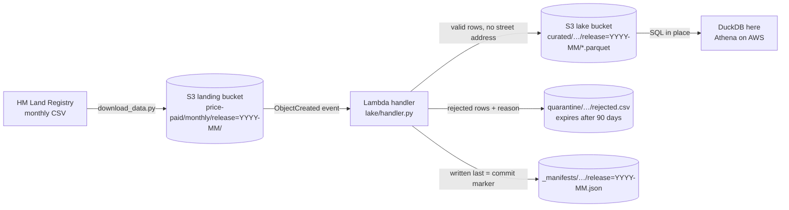

# Serverless property data lake (S3 + Lambda pattern)

> **Status: in progress.** The ingest layer (landing bucket → Lambda-style handler → validated Parquet lake) and SQL analytics over the lake are built, tested and run on the real September 2026 release. Next: deployment notes (infrastructure template and running costs), then final recommendations.

**Business question:** an estate agency or property-data team wants fresh sold-price data every month for pricing advice and market reports. How can it land HM Land Registry's monthly file, check it, and make it queryable with SQL, **without running a server or a database**, and without storing more personal address data than it needs?

This repo builds the standard AWS answer: files land in an S3 bucket, an S3 event triggers a Lambda function, the function validates the file and writes Parquet to a data lake, and analysts query the Parquet in place (Athena-style). Everything runs **offline** against [moto](https://github.com/getmoto/moto), an S3 emulator, so no AWS account or credentials are needed. The handler is ordinary boto3 code, so the same code would run on AWS.

## Architecture



| Piece | File | What it does |
|---|---|---|
| Bucket setup | `lake/infra.py` | Creates the landing and lake buckets with public access blocked, encryption at rest (SSE-S3), versioning on, and a lifecycle rule that deletes quarantine files after 90 days. Safe to run twice. |
| Validation | `lake/schema.py` | Parses the header-less CSV, rejects rows that break hard rules (GUID id, no duplicate ids, whole-pound price > 0, valid date not after the release month, published codes only), and flags odd-but-legal rows. |
| Handler | `lake/handler.py` | `lambda_handler(event, context)`: decodes the S3 event, writes curated Parquet, the quarantine CSV and the manifest. |
| Local run | `scripts/run_local.py` | Starts the emulator, uploads the file, fires the same event S3 would send (twice), queries the lake with DuckDB and writes [`results/ingest_summary.md`](results/ingest_summary.md). |
| Query layer | `lake/query.py`, `sql/` | Points DuckDB at the Parquet in S3 (Athena-style), exposes every release as one `changes` view, and runs the six numbered SQL files. |
| Analytics | `scripts/analyse_lake.py` | Rebuilds the lake on the emulator, runs `sql/` and writes [`results/ANALYTICS.md`](results/ANALYTICS.md), one CSV per query and three charts. |

### Design choices
- **Idempotent by design.** S3 delivers events *at least once*, so a duplicate is normal, not an error. The manifest stores the source file's ETag. The same ETag means skip; a corrected re-upload (new ETag) is reprocessed and overwrites the same keys, so there are never duplicate rows.
- **Manifest written last.** A reader only trusts a release once its manifest exists, so a crash during a first load never publishes a half-loaded month. Each output is a single S3 object, and an S3 PUT is all-or-nothing, so no reader ever sees a half-written file.
- **Data minimisation.** House number, flat, street and locality are dropped, and the postcode is cut to its district (`NW7`) and sector (`NW7 1`). That's enough for market analysis, and the lake holds no street-level addresses.
- **Quarantine, not silent drops.** Bad rows are kept with a reason so the data team can raise them with the publisher. They're deleted automatically after 90 days.
- **Release partitions.** `release=YYYY-MM` folders let SQL engines skip months they don't need (partition pruning), which is what keeps Athena-style queries cheap.

## Data
[HM Land Registry Price Paid Data](https://www.gov.uk/government/statistical-data-sets/price-paid-data-downloads), monthly update file: the property sales in England and Wales that HM Land Registry registered since its previous release, as a *change feed*. Each row is marked **A** (added), **C** (changed) or **D** (deleted). `scripts/download_data.py` fetches it (~16 MB) and pins the release in `data/raw/source.json` (Last-Modified date, size, SHA-256), because the file is replaced every month.

The results here use the release published on **2026-09-28** (SHA-256 `5236cb389b294f33…`), labelled `2026-09` by publication month.

Licence: Contains HM Land Registry data © Crown copyright and database right 2026. This data is licensed under the [Open Government Licence v3.0](https://www.nationalarchives.gov.uk/doc/open-government-licence/version/3/). Raw files aren't committed.

## First results: ingesting the September 2026 release
From [`results/ingest_summary.md`](results/ingest_summary.md):

- **90,867 rows in, 90,867 valid, 0 rejected.** HM Land Registry's file passes every hard rule. The quarantine path is still tested with deliberately broken rows (`tests/test_lake.py`).
- **The second, identical event was skipped** ("same source ETag already processed"), so a duplicate delivery doesn't double-count.
- **It's mostly new sales, plus corrections:** 86,284 added, 3,095 changed and 1,488 deleted records. A report that only appends rows and ignores C/D would be wrong, which the analytics step has to handle.
- **Kept but flagged:** 255 rows with no postcode, 293 sales under £10k, 296 at £5M or more, and 1,774 transfers dated before 2020 (late registrations or corrections). Transfer dates in this release run from 1995-01-12 to 2026-08-28.
- **The curated Parquet is 10.7% of the CSV size** (1.69 MB vs 15.8 MB) and carries no street-level address. Smaller files mean cheaper storage and cheaper scans.

**So what for the business:** for a small team, a monthly market-data feed can run with no server to patch and no database to size. The pipeline is safe to re-run, keeps bad data visible instead of silently dropping it, and stores only the location detail that market analysis needs.

## Analytics over the lake
From [`results/ANALYTICS.md`](results/ANALYTICS.md). Every query reads the Parquet in place on (emulated) S3; nothing is copied into a database.

**1. Applying the change feed** ([`01_current_view.sql`](sql/01_current_view.sql), [`02_change_feed.sql`](sql/02_change_feed.sql)). `price_paid_current` keeps the latest version of each transaction across releases and drops deletions, which is tested on a two-release lake (`tests/test_analytics.py`). In this lake, **none of the 3,095 changes or 1,488 deletions match a record the lake holds**, because the lake starts with this release, so the corrected and withdrawn sales were published before it existed. The view is ready for that, but correcting past sales needs a one-off historical backfill.

**2. Registration lag: recent months look weaker than they are** ([`03_registration_lag.sql`](sql/03_registration_lag.sql)). A sale only appears once HM Land Registry has processed it, so each release mixes recent and old transfers.


- Of 79,440 **existing-home** sales added in this release, 56.7% completed in the two months before it, but 39.0% completed 4 or more months earlier.
- Of 6,844 **new-build** sales, 96.2% completed 7 or more months earlier, and only 33 (0.5%) in the last two months.
- So what: a "latest month" chart built on this data will show volumes falling and new-build sales almost vanishing. That's how registration works, not a market slowdown. Treat recent months as provisional, and judge new-build activity on sales at least a year old. Measuring exactly when a month is complete needs several releases in the lake, and the release partitions are built to hold them.

**3. Market by property type** ([`04_market_by_type.sql`](sql/04_market_by_type.sql)). Standard (category A) sales, transfers in the 12 months to August 2026, as registered in this release:

| Type | Standard sales | Median price | Leasehold | Category B share |
|---|---:|---:|---:|---:|
| Semi-detached | 21,121 | £278,000 | 5.9% | 9.1% |
| Detached | 18,447 | £425,000 | 2.5% | 5.2% |
| Terraced | 18,362 | £245,000 | 8.4% | 17.7% |
| Flat/maisonette | 10,698 | £240,000 | 97.7% | 18.5% |

Category B entries (repossessions, buy-to-let mortgages, sales to companies) are 17.7% of terraced and 18.5% of flat entries, against 5.2% for detached homes, and all 4,264 "other" property entries are category B. They're kept out of the price figures because they aren't standard full-market-value sales; an agency pricing flats and terraces off a feed that mixes them in would be pricing against a different market.

**4. Busiest counties** ([`05_counties.sql`](sql/05_counties.sql)). The England & Wales median is £300,000. Greater London has 10.3% of standard sales at a £533k median (index 178), followed by Surrey (172) and Hertfordshire (152). The cheapest of the 15 busiest are Tyne and Wear (£185k, 62) and South Yorkshire (£200k, 67).


**5. New-build premium, like for like** ([`06_new_build_premium.sql`](sql/06_new_build_premium.sql)). A raw new vs existing median mixes places and property types, so this compares medians inside the same postcode district and property type (cells with 5+ sales on each side).


- **Detached: no real premium.** The median is +1.9% across 132 districts, and new builds were dearer in only 55.3% of them (middle 50%: −7.4% to +15.4%).
- **Semi-detached: +11.7%** across 51 districts, with new builds dearer in 88.2%.
- Flats (+67.3%, 15 districts) and terraced homes (+24.0%, 7 districts) have too few matched districts to rely on.
- Caveats: Price Paid Data has no floor area or age, so this isn't size-adjusted. Because of the lag above, most new-build sales here completed months before most existing-home sales, so if prices rose over the year the premium is understated.
- So what: for valuations, a new-build *semi* has a measurable premium over existing semis nearby; a new-build *detached* home mostly doesn't.

## How to run
```bash
uv venv && source .venv/bin/activate        # or python -m venv .venv
uv pip install -r requirements.txt           # or pip install -r requirements.txt
python scripts/download_data.py              # ~16 MB → data/raw/ (+ source.json)
python scripts/run_local.py                  # emulator → ingest → results/ingest_summary.md
python scripts/analyse_lake.py               # emulator → ingest → SQL over S3 → results/ANALYTICS.md + charts
pytest                                       # 11 offline tests (moto in-process, local Parquet for the SQL)
```
No AWS account is needed: `run_local.py` uses dummy credentials against a local emulator on `127.0.0.1:5055`. DuckDB downloads its `httpfs` extension once, on first run.

## Roadmap
- [x] Download script with release pinning
- [x] Bucket setup with security defaults
- [x] Lambda-style handler: validation, curated Parquet, quarantine, manifest, idempotency
- [x] Local end-to-end run + 7 offline tests
- [x] SQL analytics over the lake: A/C/D change-feed view, registration lag, prices by property type and county, new-build premium (+4 tests)
- [ ] Deployment notes: an infrastructure-as-code template (S3 event → Lambda), IAM least-privilege policy, and a monthly cost estimate
- [ ] Findings, recommendations and limitations
