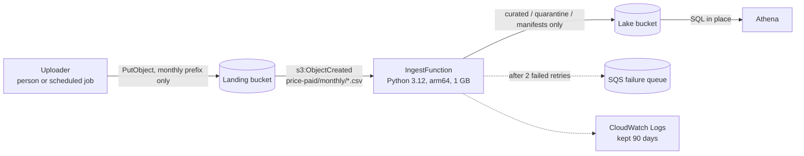

# Deploying to AWS

Everything in this repo runs offline against an S3 emulator. This page is the path to running the same code on a real AWS account. **It hasn't been deployed from here** (that needs an AWS account). What *is* checked offline:

- `infra/template.yaml` passes [cfn-lint](https://github.com/aws-cloudformation/cfn-lint), including the SAM transform (`tests/test_deploy.py`).
- The template agrees with the code: bucket environment variables, lake prefixes, the S3 event filter and the retention settings (`tests/test_deploy.py`).
- The function's IAM policy is enough, and no more: the handler runs on the emulator **with IAM enforcement on**, using only that policy, and succeeds. Writing outside its three prefixes, deleting, writing to the landing bucket, reading other landing files and changing bucket policy are all denied (`tests/test_deploy.py`).
- The Lambda bundle holds only the four modules the handler needs and imports without DuckDB or moto (`tests/test_deploy.py`).

## What gets created



| Resource | Settings |
|---|---|
| `LandingBucket`, `LakeBucket` | Named `<stack>-landing-<account>` / `<stack>-lake-<account>`. Public access blocked, SSE-S3 encryption, versioning on, overwritten versions deleted after 30 days, HTTPS-only bucket policy. The lake also deletes quarantine files after 90 days. Same settings as `lake/infra.py` uses locally. |
| `IngestFunction` | `lake.handler.lambda_handler`, Python 3.12 on arm64 (Graviton, about 20% cheaper per GB-second than x86 in London), 1,024 MB, 5-minute timeout. pandas and pyarrow come from the [AWS SDK for pandas](https://aws-sdk-pandas.readthedocs.io/en/stable/layers.html) managed layer, boto3 from the runtime. |
| Function role | `s3:GetObject` on `landing/price-paid/monthly/*`; `s3:PutObject` on the lake's `curated/`, `quarantine/` and `_manifests/` prefixes; `s3:GetObject` on `_manifests/`; `s3:ListBucket` on the lake (without it, S3 answers a missing manifest with 403 instead of 404, and the first load of a release would fail). No delete permission. SAM also attaches the AWS-managed basic execution policy for CloudWatch Logs. |
| S3 → Lambda trigger | `s3:ObjectCreated:*`, prefix `price-paid/monthly/`, suffix `.csv`. Other uploads don't invoke the function. |
| Failure handling | S3 invokes Lambda asynchronously. After 2 retries, a failed event goes to an SQS queue created by SAM, so a failed month is visible instead of lost. |
| `LandingUploaderPolicy` | A managed policy to attach to whoever uploads the monthly file: `s3:PutObject` into the monthly prefix and nothing else. |

## Steps (needs an AWS account)

Prerequisites: an AWS account, the [AWS CLI v2](https://docs.aws.amazon.com/cli/latest/userguide/getting-started-install.html) with credentials configured, and the [AWS SAM CLI](https://docs.aws.amazon.com/serverless-application-model/latest/developerguide/install-sam-cli.html).

```bash
# 1. Bundle the function code (lake/ modules only) into build/function/
python infra/package.py

# 2. Deploy. --resolve-s3 lets SAM create a bucket for the code bundle.
#    Stack names must be lower-case, because they become part of bucket names.
sam deploy --template-file infra/template.yaml --stack-name ppd-lake \
  --region eu-west-2 --capabilities CAPABILITY_IAM --resolve-s3
#    In another region, pass that region's layer ARN:
#    --parameter-overrides PandasLayerArn=arn:aws:lambda:<region>:336392948345:layer:AWSSDKPandas-Python312-Arm64:<version>

# 3. Land a monthly file (bucket names are in the stack outputs).
aws s3 cp data/raw/pp-monthly-update.csv \
  "s3://ppd-lake-landing-<account>/price-paid/monthly/release=2026-09/pp-monthly-update.csv"

# 4. Check it: the manifest is written last, so its presence means the release is published.
aws s3 cp "s3://ppd-lake-lake-<account>/_manifests/price_paid/release=2026-09.json" -
sam logs --stack-name ppd-lake --name IngestFunction
```

### Querying with Athena

Athena needs a table over the curated prefix. Partition projection means new months appear without running `MSCK REPAIR` or a crawler. Set a query result location for the workgroup first (for example a separate bucket or an `athena-results/` prefix).

```sql
-- Not run here (needs AWS). Columns match the curated Parquet; `release` is the
-- partition key only (the Parquet's own copy of it is ignored).
CREATE EXTERNAL TABLE price_paid_changes (
  transaction_id string, price bigint, date_of_transfer date, transfer_month string,
  postcode_district string, postcode_sector string, property_type string, new_build boolean,
  tenure string, town_city string, district string, county string,
  ppd_category string, record_status string)
PARTITIONED BY (release string)
STORED AS PARQUET
LOCATION 's3://ppd-lake-lake-<account>/curated/price_paid_changes/'
TBLPROPERTIES (
  'projection.enabled' = 'true',
  'projection.release.type' = 'date',
  'projection.release.format' = 'yyyy-MM',
  'projection.release.range' = '2026-09,NOW',
  'projection.release.interval' = '1',
  'projection.release.interval.unit' = 'MONTHS',
  'storage.location.template' = 's3://ppd-lake-lake-<account>/curated/price_paid_changes/release=${release}/'
);
```

The queries in `sql/` are written for DuckDB. Athena uses Trino SQL, so a few functions need swapping (for example `median(x)` → `approx_percentile(x, 0.5)`, and `SELECT * EXCLUDE (...)` → an explicit column list). Athena doesn't read manifests, so check that a release's manifest exists before reporting on it.

### Tearing down

The buckets are versioned, so CloudFormation can't delete them until every object version is gone. Empty both buckets first (the S3 console's **Empty** button removes all versions), then run `sam delete --stack-name ppd-lake`.

## Running cost

From [`results/COSTS.md`](../results/COSTS.md): prices from the public AWS Price List for London, workload measured here (median 2.4 s and 266 MB peak per monthly file, billed at 3× that time to allow for Lambda's slower CPU share).

- **About $0.05 a month** for one release a month, a year of releases kept, and 500 Athena queries. Athena is 91% of that; Lambda compute is under $0.0001 (7 GB-seconds, against an always-free allowance of 400,000).
- What would move it: query volume and query shape. Ten times the queries is about $0.48. Querying the raw CSVs instead of Parquet costs about 9× as much for the same queries.

## Historical backfill (design, not built)

The lake starts with the September 2026 release, so changes and deletions to older sales have nothing to apply to (see the README's analytics section). To fix that:

1. **Use the yearly files, not the complete file.** The complete file is 5.15 GB; the yearly files (`pp-YYYY.csv`) are about 170–226 MB each (2025: 170 MB, 2021: 223 MB, 2007: 226 MB, checked with HEAD requests). The handler reads a whole file into memory, so even a yearly file needs its memory measured before it goes through Lambda.
2. **Run it once, outside Lambda.** A backfill happens once, so the simplest route is to run the same `lake.handler.process_object` code from a laptop or one-off job with write access to the lake, rather than sizing Lambda for it.
3. **Label the baseline so it sorts before the monthly releases.** `price_paid_current` keeps the latest version of each `transaction_id` by `release`, so a baseline partition labelled before `2026-09` lets every monthly change override it. Overlap between the baseline and the first monthly file is harmless for the same reason.
4. **Partition the baseline by year** so queries about recent years don't scan every year since 1995. That's the main lever on Athena cost once the lake holds about 0.55 GB of Parquet (rough estimate in `results/COSTS.md`).
