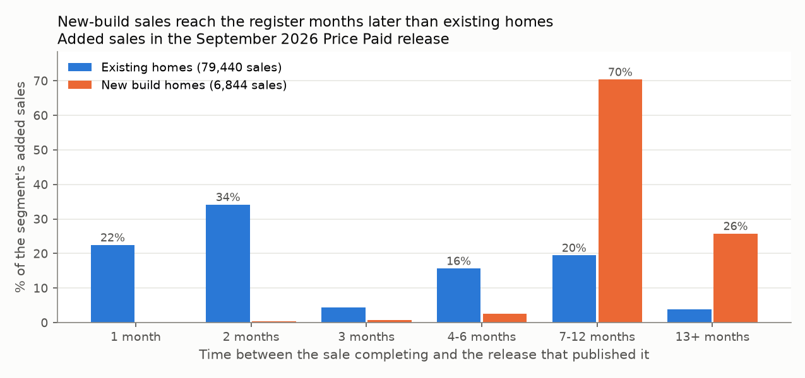
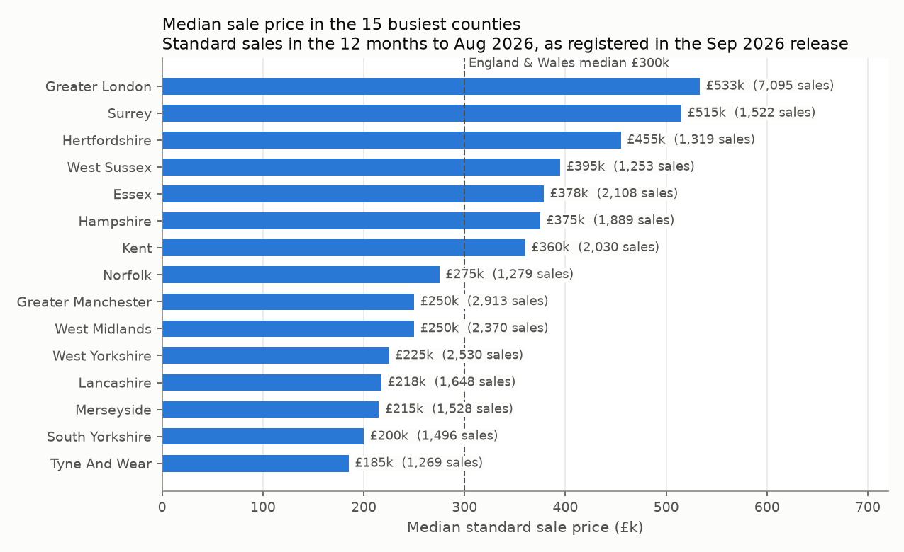
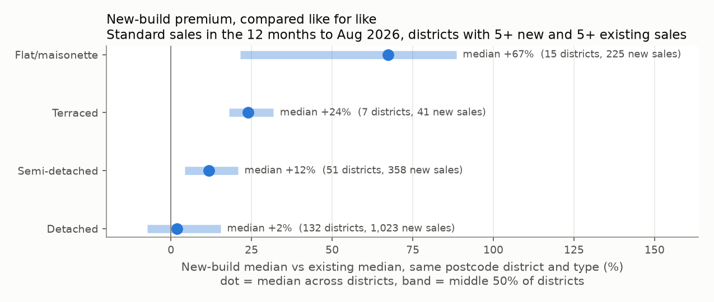

# Lake analytics: release 2026-09

_Generated by `scripts/analyse_lake.py`: DuckDB querying the curated Parquet in place on the local S3 emulator. Queries are in [`sql/`](../sql); one CSV per query in [`csv/`](csv)._

## 1. Applying the change feed (`01_current_view`, `02_change_feed`)
`price_paid_current` keeps the latest version of each transaction across releases and drops deletions.

| release   | record_status   |   rows |   matches_earlier_release |   no_earlier_record |   median_price |
|:----------|:----------------|-------:|--------------------------:|--------------------:|---------------:|
| 2026-09   | A               | 86,284 |                         0 |              86,284 |        290,000 |
| 2026-09   | C               |  3,095 |                         0 |               3,095 |        241,900 |
| 2026-09   | D               |  1,488 |                         0 |               1,488 |        211,500 |

A C or D row with no earlier record means the lake doesn't yet hold the sale being corrected or deleted.

## 2. Registration lag (`03_registration_lag`)
Added sales in the latest release, by months between the transfer and the release month.

| segment   | lag_bucket   |   sales |   pct_of_segment |
|:----------|:-------------|--------:|-----------------:|
| existing  | 1 month      |  17,870 |             22.5 |
| existing  | 2 months     |  27,171 |             34.2 |
| existing  | 3 months     |   3,451 |              4.3 |
| existing  | 4-6 months   |  12,443 |             15.7 |
| existing  | 7-12 months  |  15,463 |             19.5 |
| existing  | 13+ months   |   3,042 |              3.8 |
| new build | 1 month      |      10 |              0.1 |
| new build | 2 months     |      23 |              0.3 |
| new build | 3 months     |      50 |              0.7 |
| new build | 4-6 months   |     175 |              2.6 |
| new build | 7-12 months  |   4,819 |             70.4 |
| new build | 13+ months   |   1,767 |             25.8 |

## 3. Market by property type (`04_market_by_type`)
Current view, transfers in the 12 months before the release month. Prices use standard (category A) sales only; `pct_additional` is the share of category B entries (repossessions, buy-to-let, company sales).

| property_type   |   standard_sales |   median_price |   pct_leasehold |   pct_new_build |   additional_entries |   pct_additional |
|:----------------|-----------------:|---------------:|----------------:|----------------:|---------------------:|-----------------:|
| Semi-detached   |           21,121 |        278,000 |             5.9 |             5.4 |                2,108 |              9.1 |
| Detached        |           18,447 |        425,000 |             2.5 |            11.4 |                1,004 |              5.2 |
| Terraced        |           18,362 |        245,000 |             8.4 |             2.1 |                3,938 |             17.7 |
| Flat/maisonette |           10,698 |        240,000 |            97.7 |             5.4 |                2,423 |             18.5 |
| Other           |                0 |              - |               - |               - |                4,264 |            100.0 |

## 4. Busiest counties (`05_counties`)
Standard sales, same window. Price index: England & Wales median (£300,000) = 100.

| county             |   sales |   pct_of_sales |   median_price |   price_index |
|:-------------------|--------:|---------------:|---------------:|--------------:|
| GREATER LONDON     |   7,095 |           10.3 |        533,335 |           178 |
| GREATER MANCHESTER |   2,913 |            4.2 |        250,000 |            83 |
| WEST YORKSHIRE     |   2,530 |            3.7 |        225,000 |            75 |
| WEST MIDLANDS      |   2,370 |            3.5 |        250,000 |            83 |
| ESSEX              |   2,108 |            3.1 |        378,500 |           126 |
| KENT               |   2,030 |            3.0 |        360,000 |           120 |
| HAMPSHIRE          |   1,889 |            2.8 |        375,000 |           125 |
| LANCASHIRE         |   1,648 |            2.4 |        217,500 |            73 |
| MERSEYSIDE         |   1,528 |            2.2 |        215,000 |            72 |
| SURREY             |   1,522 |            2.2 |        515,000 |           172 |
| SOUTH YORKSHIRE    |   1,496 |            2.2 |        200,000 |            67 |
| HERTFORDSHIRE      |   1,319 |            1.9 |        455,000 |           152 |
| NORFOLK            |   1,279 |            1.9 |        275,000 |            92 |
| TYNE AND WEAR      |   1,269 |            1.8 |        185,000 |            62 |
| WEST SUSSEX        |   1,253 |            1.8 |        395,000 |           132 |

## 5. New-build premium (`06_new_build_premium`)
Per postcode district × property type with at least 5 new and 5 existing standard sales.

| property_type   |   districts |   new_sales |   existing_sales |   median_premium_pct |   p25_premium_pct |   p75_premium_pct |   pct_districts_new_dearer |
|:----------------|------------:|------------:|-----------------:|---------------------:|------------------:|------------------:|---------------------------:|
| Detached        |         132 |       1,023 |            2,141 |                  1.9 |              -7.4 |              15.4 |                       55.3 |
| Semi-detached   |          51 |         358 |              889 |                 11.7 |               4.3 |              20.8 |                       88.2 |
| Flat/maisonette |          15 |         225 |              410 |                 67.3 |              21.5 |              88.5 |                       86.7 |
| Terraced        |           7 |          41 |               99 |                 24.0 |              18.1 |              31.8 |                       85.7 |

